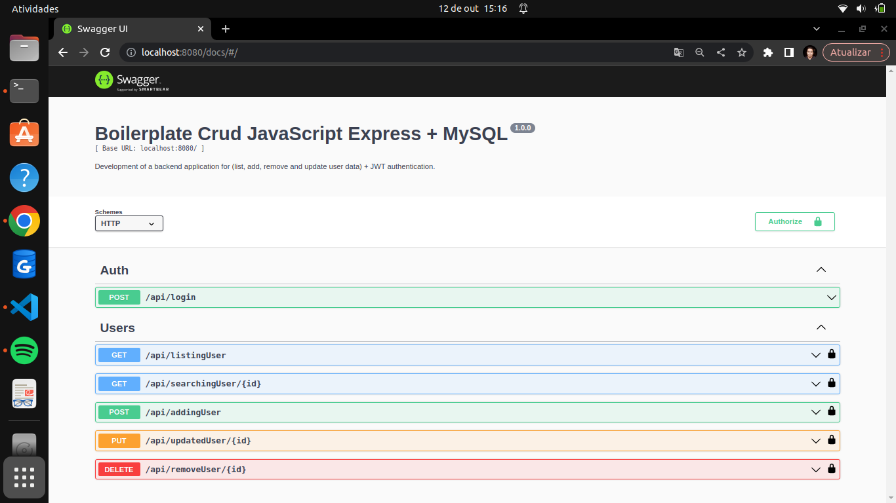

# Boilerplate Crud JavaScript Express MySQL

<p align="center">
    
</p>

<p align="center">
   
   
   
   
   
   
   
</p>

## About:

The project was organized based on a simple idea: implement a crud with origins in your migrations and seeds using ORM Sequelize. Its main functionality is to perform the operation of (list, register, update and remove users).

Even if you don't have the version in production at the time of this reading, just perform the operations that will be explained in the topics below.

## Features:

As with any backend project, a few steps were taken until the basic completion of the first version of this project.

- Server development.
- Documentation initialization with swagger.
- Development and application of migrations and seeds.
- Application of routes and controllers.

### Example: 

- [x] Connect database, routes, controllers, middlewares and orm (seeds and migrations) + swagger documentation on the main server.
- [x] Create environment of main routes and administrative routes, were linked together. Without a complex mix to understand (For better understanding, see [routes] in the project)
- [x] Development of the following functionalities: 1) List of users - 2) Register users - 3) Update users - 4) Remove users.
- [x] API Documentation Generator with Swagger Generate. It is not necessary to use insomnia, there is an api test generator, its use will be explained in the next topics. 

## Layout: 

<p align="center">
    
</p>
Video result can be seen on my linkedin - publications:

[mateusmaciel340](https://www.linkedin.com/in/mateusmaciel340/)

## How to run the project?

The project does not need to be in production so that it can run easily on your machine, you just need to put the implementations in their proper places, see how:

### Usage settings:

It is necessary to create a `.env` file and assign some basic settings inside it. Create this file in the root of your project.

Right after creating your file, put the following lines and their functionalities:

```bash
# .env file created!

PORT_SERVER=8080

DB_NAME=crud_javascript
DB_USER=root
DB_PASS=development
DB_DIALECT=mysql
DB_HOST=localhost
DB_PORT=3306 #mysql

CORS_SERVER=localhost:3000 #react

SECRET_KEY=12345678
```

### Creating a database with docker:

It is very simple to create a database with docker, but you will need to have docker and docker-compose installed on your machine, if the steps below will not work.

There is a `docker-compose.yml` file that already has the necessary settings, so just initialize:

```bash
docker-compose up -d
```

Just wait a few seconds, and database initialized. If you already have a database on your machine, discard this activity.

### Booting server and documentation:

Like any other project, there are dependencies that need to be generated on your machine. And like any other in the same way, there is a practical way to read our api with swagger, let's understand the two steps:

#### Server:

```bash
npm run start:dev
```

#### Documentation:

```bash
npm run swagger-autogen
```

## Technologies

The following tools were used in building the project:

### Backend (Nodejs)

- Nodejs
- ExpressJs
- MySQL
- Sequelize
- Docker
- Npm

## Contributors

<table>
    <thead>
        <tr>
            <td>
                
            </td>
        </tr>
    </thead>
    <tbody>
        <tr>
            <th>Mateus Maciel</th>
        </tr>
    </tbody>
</table>

## How to contribute?

1. Fork the project.
2. Create a new branch with your changes: `git checkout -b my-feature`
3. Save the changes and create a commit message telling what you did: `git commit -m Modifying this [...]`
4. Submit your changes: `git push origin my-feature`

## License

This project is under license [MIT](https://github.com/git/git-scm.com/blob/main/MIT-LICENSE.txt).